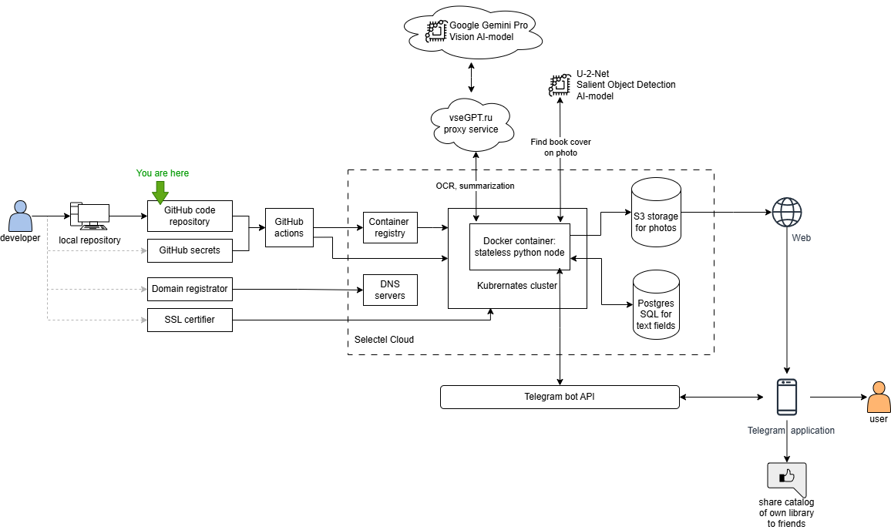
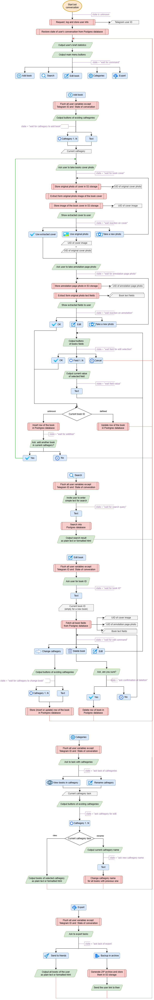

# Catalog of the home library with AI-recognition of covers and annotations

[](images/avatar.jpg) 


Telegram bot to photo the covers and annotations of your books and create a catalog of your home library. Share the catalog with your friends. No manual input: AI will do everything for you, and it will take no more than 10 seconds to enter one book. If necessary, you can always upload your collection to a file.
https://t.me/home_library_ai_bot

## How it works



## GitHub actions secrets

| Name | Description | Usage |
| - | - | - |
| REGISTRY_HOST | Hostname of Container Registry to push docker image | CI/CD |
| REGISTRY_USERNAME | Login of Container Registry | CI/CD |
| REGISTRY_PASSWORD | Password of Container Registry | CI/CD |
| KUBECONFIG | YAML text config of production Kubernates cluster to deploy docker container | CI/CD |
| TELEGRAM_TOKEN | Strint token for production telegram-bot @home_library_ai_bot | Production |
| POSTGRES_HOST | Hostname or IP-address of Postgres database server | Production |
| POSTGRES_PORT | IP-Port of Postgres database server | Production |
| POSTGRES_DATABASE | Database name of Postgres database | Production |
| POSTGRES_USERNAME | Login of Postgres database | Production |
| POSTGRES_PASSWORD | Password of Postgres database | Production |
| AWS_ENDPOINT_URL | URL of S3 storage | Production |
| AWS_BUCKET_NAME | Bucket name in S3 storage | Production |
| AWS_ACCESS_KEY_ID | Access key to S3 storage | Production |
| AWS_SECRET_ACCESS_KEY | Secret key to S3 storage | Production |

## Project files

Program files:

- `homelib.py` - core of telegram-bot
- `modules\environment.py` - prepare environment variables, classes and connections
- `modules\databasecreation.py` - script to create tables in Postgres database on the first run of script
- `modules\handle_addbook.py` - handlers to for processing bot messages in adding book mode

Deployment scripts:

- `requirements.txt` - python's library dependencies
- `dockerfile` - instructions: how to build Docker container
- `deployment.yaml` - instructions: how to deploy it on Kubernates cluster
- `.gitignore` - hide my python cache, debug environment variables with sectets, certificates, etc.
- `.github\workflows\` - instructions: automatization CI/CD with GitHub Actions

Documentation:

- `README.md` - current description
- `images\` - floder with images for current description

## Basic usage

Just start chatting with [@home_library_ai_bot](https://t.me/home_library_ai_bot) in telegram. We use `Telegram ID` to identificate user and store it's books. Your telegram ID is permanent and does not change when you changing mobile number or telegram nickname.

Cathegories are not stored in database as a separate entity. They collect everytime from stroed books of the user. Then user add new cathegory, it stored in users variable and applied to the new book. Then just one book with this cathegory saved, we will start receiving this cathegory from selection cathegories of all users books.

We store all your photos with unique anonymous identifiers is S3 file storage. So if someone known the photo identificator - they can see it. Access to other people's photos is unlikely, but try not to photograph things that you would not like to allow for public review.

For each book we need two photos:
- Photo of book's cover - for extract cover's picture and store them in library databas
- Photo of first book's page with annotation - for extract from them text imformation about the book

## AI processing of photo of book's cover 

Photo of the book cover on plain surface, for example, on the desk. Use the desktop lamp or mobilephone flash to illuminate the book. Avoid mirrored or glass surfaces. Try not to use tables with a colorful surface, such as wooden ones. Hold the phone at a right angle to the table to avoid trapezoidal deformations.

We use [U-2-Net Salient Object Detection AI-model](https://github.com/xuebinqin/U-2-Net) of th [python rembg library](https://github.com/danielgatis/rembg) to remove background, find the cover's rectanlge and them align it in the form of a vertical rectangle.

| Source photo | Extracted cover |
| - | - |
| [](examples/find_cover/cover1.jpg) | [](examples/find_cover/output1.jpg) |

## AI processing of photo of book's annotation

Take a picture of the first annotation page of the book in the same way. Inevitably, your fingers holding the book will get into the photo. If they don't obscure the text, it's okay.

We use an external LLM model for OCR the first annotation page of the book to text and extract from them some important fields about the book. We test some LLM's such as:
- Alibaba `qwen2.5-vl-72b-instruct`
- Anthropic `claude-3.7-sonnet`
- Google `gemini-pro-vision`
- OpenAI `gpt-4o`
- OpenAI `gpt-4o-mini`
- Meta `llama-3.2-90b-vision-instruct`

We found Google `gemini-pro-vision` to be the best in terms of price-performance ratio.

We exctract these fields:
| Field | Value |
| - | - |
| `name` | Book name |
| `authors` | Authors of the book |
| `pages` | Pages count in the book |
| `publisher` | Organiozation name of book's publisher |
| `year` | Year of publish the book |
| `ISBN` | International Standard Book Number, if exists |
| `annotation` | Full text of annotation, extracted from th page |
| `brief` | Brief summary of the annotation |

For example:
| Source photo | Extracted fields |
| - | - |
| [](examples/extract_book_info/page1.jpg) | `name` = Птицы на кормушках: Подкормка и привлечение <br/> `authors` = Василий Вишневский <br/> `pages` = 304 <br/> `publisher` = Фитон XXI <br/> `year` = 2025 <br/> `ISBN` = 978-5-6051287-5-5 <br/> `annotation` = Книга даёт исчерпывающие ответы на самые важные вопросы: как, чем, когда и каких диких птиц подкармливать. Делать это можно в самых разных местах: от балкона городской квартиры до дачного участка, парка или близлежащего леса. Большое внимание в книге уделено разнообразию кормов, и поскольку не все они полезны, то и тому, чем можно (а чем нельзя) кормить, как приготовить корм, как его хранить. Кроме подкормки, вы можете посадить определённые растения, которые привлекут ещё больше птиц на дачный участок. Поскольку посещение кормушек связано с рядом опасностей, в книге даны очень важные рекомендации, как их избежать и как защитить пернатых гостей от врагов и конкурентов. Если вы повесили кормушку... <br/> `brief` = Подкормка птиц — очень важное и нужное дело, а наблюдение за пернатыми посетителями кормушек приносит массу удовольствия. |
| [](examples/extract_book_info/page2.jpg) | `name` = Асимптотические методы для линейных обыкновенных дифференциальных уравнений <br/> `authors` = Федорюк М. В. <br/> `pages` = 352 <br/> `publisher` = Наука <br/> `year` = 1983 <br/> `ISBN` = null <br/> `annotation` = В книге содержатся асимптотические методы решения линейных обыкновенных дифференциальных уравнений. Рассмотрен ряд важных физических приложений к задачам квантовой механики, распространения волн и др. Для математиков, физиков, инженеров, а также для студентов и аспирантов университетов и инженерно-физических вузов. <br/> `brief` = В книге содержатся асимптотические методы решения линейных обыкновенных дифференциальных уравнений. |

## Telegram-bot's dialog algorithm



Here is [the first handwritten edition](images/manuscript.pdf) of this algorithm.

## PostgreSQL database

Where are two application tables in the PostgreSQL database:

1. Table `logs` for log of starting the bot:
```SQL
CREATE TABLE IF NOT EXISTS logs (
    user_id BIGINT,
    nickname TEXT,
    username TEXT,
    datetime TIMESTAMP DEFAULT CURRENT_TIMESTAMP
)
```

2. Table `books` for store information of all books, added by users:
```SQL
CREATE TABLE IF NOT EXISTS books (
    user_id BIGINT,
    book_id BIGINT,
    cathegory TEXT,
    uidphoto UUID,
    uidcover UUID,
    uidannotation UUID,
    name TEXT,
    authors TEXT,
    pages TEXT,
    puiblisher TEXT,
    year TEXT,
    isbn TEXT,
    annotation TEXT,
    brief TEXT,
    datetime TIMESTAMP DEFAULT CURRENT_TIMESTAMP,
    PRIMARY KEY (user_id, book_id)
)
```

And two internal tables for continuous operation of the bot: one to store current state of conversation, and another to store current information, received from user. These tables used by `PostrgreSQL-storage` plugin, written by me for [`aiorgam`](https://aiogram.dev/) library.

3. Table `aiogram_states` for store current state of bot-user conversation
```SQL
CREATE TABLE IF NOT EXISTS aiogram_states(
    chat_id BIGINT NOT NULL,
    user_id BIGINT NOT NULL,
    state TEXT,
    PRIMARY KEY (chat_id, user_id)
)
```

4. Table `aiogram_data` for store information, received from user during the conversation:
```SQL
CREATE TABLE IF NOT EXISTS aiogram_data(
    chat_id BIGINT NOT NULL,
    user_id BIGINT NOT NULL,
    data JSON,
    PRIMARY KEY ("chat_id", "user_id")
)
```

You don't need to create these tables manualy. Then telegram-bot connect to postgres, it try to create these tables, if they are not exists.

## Telegram bot's commands

There are 5 bot's commands, whitch can be executate from any bot state. You don't need to ask `@BotFather` add these commands to main menu button. They added automaticaly by the bot itself:
- `add` - Add book
- `find` - Search
- `edit` - Edit book
- `cat` - Cathegories
- `export` - Export
- `lang` - Language

Also your bot must process `/start` command - for the first run of each user.

## The knowledge I have earned
- Comparing different pythons framework for telegram bots. I chose aiogram for its beautiful structure and thoughtful concept
- Using aiogram FSMstore to remember state of conversation and user data, entered on previous steps of the dialogue
- Wrote my own library to use PostgreSQL database to store state and user data on aiogram FSMstore
- Using inline buttons in telegram chat
- Timely removing of old, outdated inline buttons
- Create multilanguage application and add or change localization without edit source code
- I realized that the best way is to store in program code only shortcuts for string literals. And all full strings, included default english language, should be stored in local files
- Plural numbers localizaion
- CI/CD with docker container generation and deploy it on kubernates cluster
- Using requirements.txt to build docker container with python's program
- Using GitHub secrets to deploy container and for transmission in it database coordinates and API keys
- Using Visual studio code launch.json to emulate environment variables with GitHub secrets
- Arrange branches: main to deploy on production and develop to store development changes
- Push files in S3 store, including asynchronous mode and get links to them